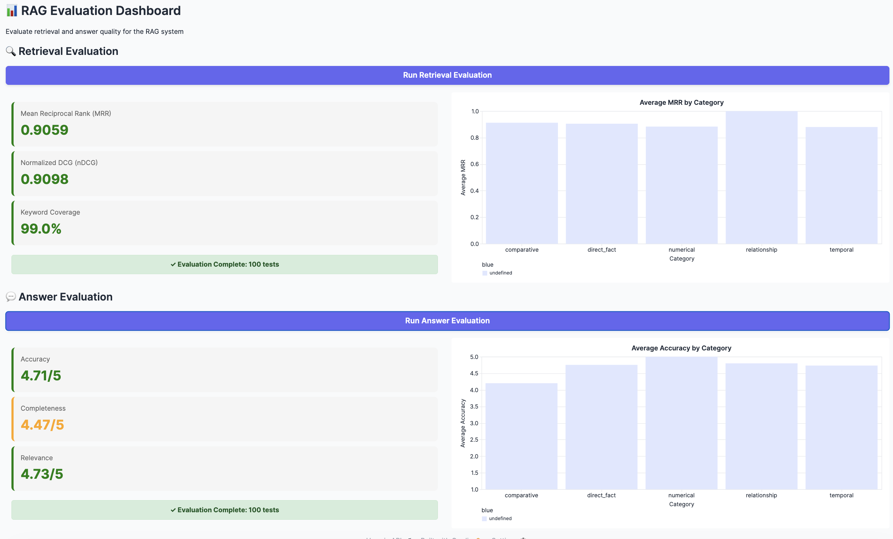
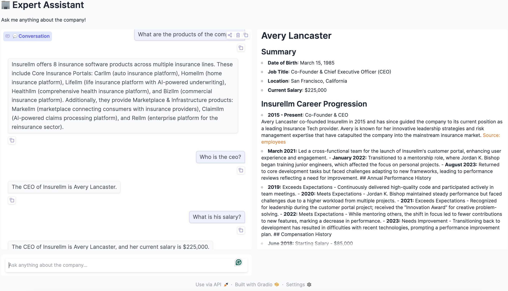

# RAG Expert Question-Answering System

This is a AI assistant system that can answer user questions based on the specific knowledge database. 

It is a project for researching and practicing agentic AI. The Pipeline is implemented with langchain, chroma and gradio. 

## Setup

- Prepare the environment:
```bash
    uv sync
```
or you may install the packages in the requirements.txt using your own way. 

- Prepare the `.env` file:

```
OPENAI_API_KEY=
# or other model API key 
```

## Vector Database

Before using the AI system, you need to ingest the documents of the specific knowledge you have into the vector database.


Vector database used in the project is Chroma from langchain_chroma.  

To chunk the documents and add the embeddings into the vector database, run
```bash
make ingest
```


## Evaluation App
This is a UI for users to run evaluation on all the questions in the test set. 

The evaluation contains: 

- **retrieval metrics**:  which evaluate how relevance the retrieved chunks / context are to the questions; 

- **Answer quality metrics**: which show how the accuracy, completeness and relevance of the generated answers, by comparing with the reference answers in the test set using a evaluation LLM. 

Demonstration:



## Chatbot

You can launch the chatbot app by running:

```bash
make chatbot
```
Demonstration:


## Other

- Single Question-Answering

```bash
make answer
```

- Evaluate on Single Test Question
```bash
make evaluate
```
